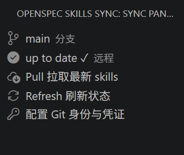

# OpenSpec Skills Sync

> 一个面向非开发者的 VS Code 插件，把"拉取最新 OpenSpec skills 文档"简化成点一个按钮——无需任何 Git 命令知识。

> A VS Code extension for non-developers that turns "pull the latest OpenSpec skills docs" into a single button click — no Git knowledge required.

> 公开源码 (Public Source): https://github.com/KraLurmumcoelcarix-173/OpenSpec-Git-Sync-VS-Code-Plugin 

## 文档 / Documentation

- 📘 [中文文档](./README.zh-CN.md)
- 📗 [English](./README.en.md)

